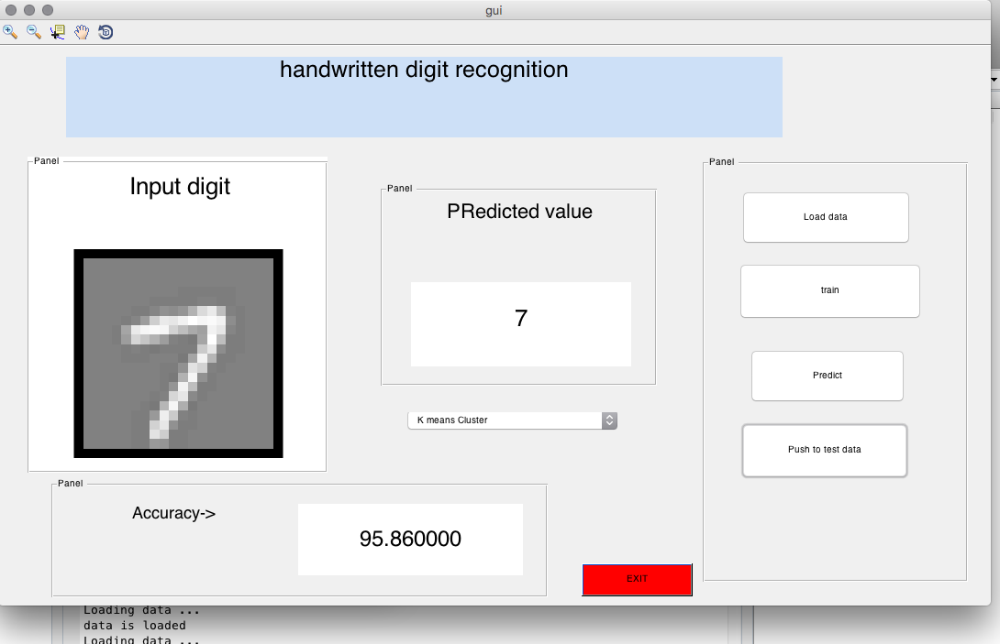

# Handwritten-Digit-Recognition-tool-using-MATLAB

Using Logistic Regression method to recognise handwritten digits from 20x20 grayscale image.

Kindly run training.m once to load data in worklpace before running gui.m

This project is a direct implementation of CS229 Machine Learning course from Stanford by Andrew Ng

